# 大致脉络

```txt
这一系列主要讲的就是常用的容器，其中会在ReadMe中讲解我了解到的一些知识，会在0x-stl.cpp中记录侯捷老师讲解的关于各个容器的源代码。
  01-list.cpp:list容器的讲解源码。
  02-vector.cpp:vector容器的讲解源码。
  03-array.cpp:array容器的讲解源码。
  04-deque.cpp:deque容器的讲解源码。
  05-stack.cpp:栈
  06-queue.cpp:队列
  07-heap.cpp:堆
  08-priority_queue.cpp:带有权值的queue
  09-slist.cpp:单向链表
  11-RB-tree.cpp:红黑树
  12-set_multiset.cpp:红黑树底层的set
  13-map_multimap.cpp:红黑树底层的map
  14-hashtable.cpp:散列表
  15-hash_set_multiset.cpp:散列表底层的set
  16-hash_map_multimap.cpp:散列表底层的map
```

**关于容器的核心精彩的部分是扩充容量：**
理解这里会很清楚的理解这个容器的内涵

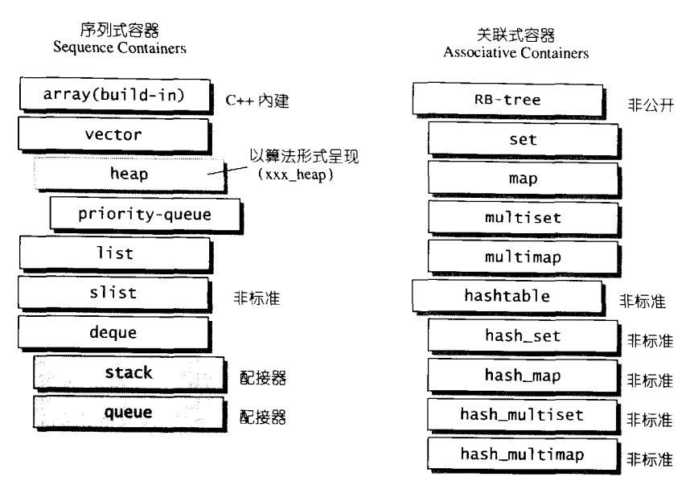

## 1. 序列式容器

- 序列式容器：其中的元素都是可序的。

**G2.9与G4.9：**

- 大多数的代码都是G2.9版本的
- G2.9的可读性明显的高于G4.9
- G4.9为了使它的框架更大，使G2.9一个类可以完成的事情分成了多个类来完成
  - 它通常设计成了：本体-继承->base-组合->impl-继承->std::allocator
- 但是G4.9虽然扩充了很多，但是功能还是很少的，并没有为它添加很多的功能，显得代码臃肿

### 1.1. list

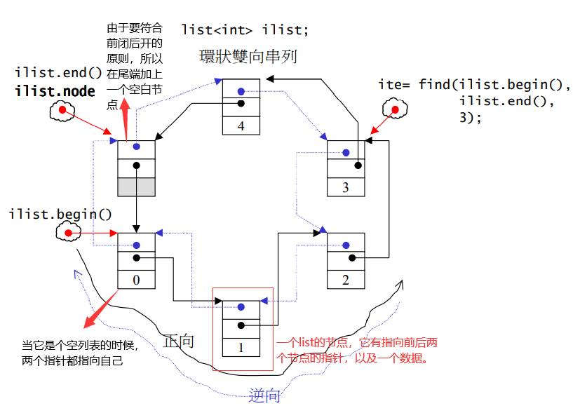

**注意：**

- 关于list的大小：T+两个指针大小
- iterator设计成了一个类：这是因为list不是连续的空间，如果就是简单的设计成了指针，那么会指向错误的空间
- list本身和list的节点是不同结构的，需要分开设计。
- 由于STL list是一个双向链表，迭代器必须具备前移、后移的能力，所以list提供的是Bidirectional iterators

#### 1.1.1. list的数据结构

由于要符合它的范围是前闭后开的原则，所以要在换装链表的尾端加上一个空白节点。

#### 1.1.2. list_iterator

- 可以在使用迭代器的时候进行插入和删除操作。
- 删除也只有 "被删除的那个元素" 的迭代器失效（这个怎么说呢？一个list应该只有一个迭代器的，他应该是想说被删元素就无法迭代它了）
- 关于++、--操作：
  - 迭代器有个node指针，指向当前的节点
  - 当进行++、--操作的时候就是给node指针赋予当前节点的上一个/下一个节点的指针
  - 相对于vector的迭代器简单的指针指向空间，这两个大同小异的，都是指针指向节点然后向前向后走罢了，只不过vector空间连续所以简单了而已。

#### 1.1.3. 对元素的操作

**迁移数据要保证两个list的完整性**
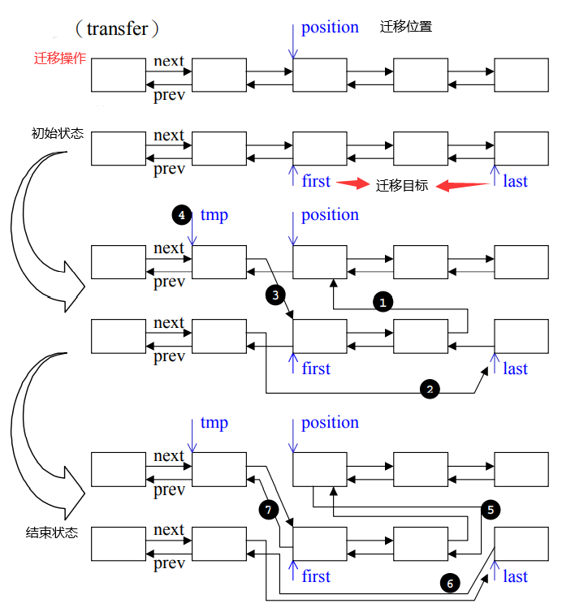

### 1.2. vector

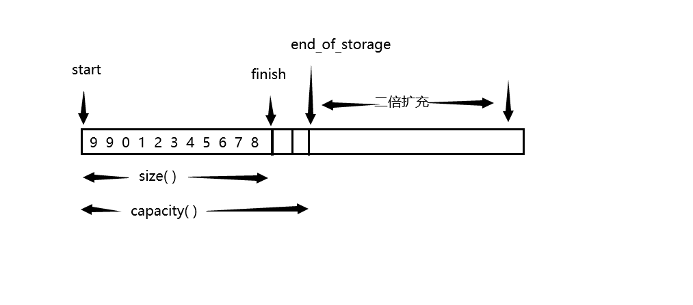

**注意：**

- 简单理解的话就把它当作数组
- 它可以动态扩充
- 它就像一个数组，它的内存扩充是二倍扩充
  - 当容量不够时就另寻一个空间，然后将数据移动过去。
- 它的关键在于对其大小的控制以级重新配置时的数据移动效率。
- 它是在一块内存空间上的，所以对数据的访问会快一些，但是插入和删除一些数据会变得慢些

### 1.3. array  

它就是个简单的连续空间存储数据，定义时就固定了大小。

### 1.4. deque

双开口的数据结构

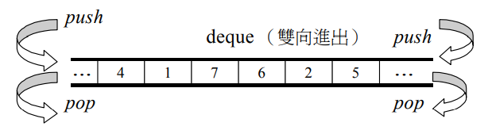

分段连续，它的如何实现伪连续很有意思。

**deque和vector的差异：**

1. deque允许对头端元素进行插入和移除操作
2. deque没有容量的观念，因为它是动态的以连续空间组成的
3. 它的迭代器很复杂
4. 所以：尽量选择vector

#### 1.4.1. deque的中控器

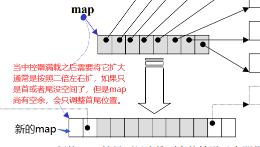

- deque的最大任务就是维护它整体连续的假象
- deque采用一块map作为中控：
  - 它是一块连续的小块空间
  - 每个元素(节点)都是指针，指向另一段比较大的连续线性空间(缓冲区)那才是deque的主要存储的空间
  - 允许自己指定空间的大小，默认0为512bytes

#### 1.4.2. deque的迭代器

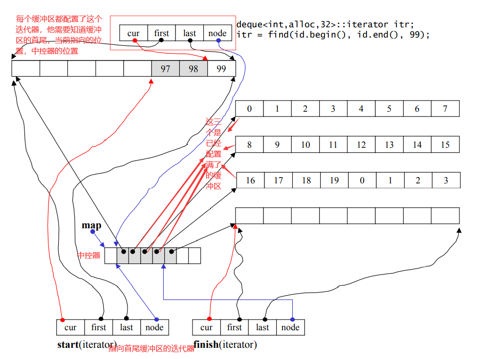

- 为了维护deque整体连续的假象，它的operator++、operator--付出了很多
- 作为deque的迭代器需要有什么功能呢？
  1. 能够指出缓冲区在哪里
  2. 能够判断是否在缓冲区的边缘
  3. 能够跳到上一个或下一个缓冲区
  4. 可以随时掌握中控器

#### 1.4.3. deque的数据结构

- 维护一个指向map的指针
- 维护start，finish两个迭代器
  - start指向第一缓冲区的第一个元素
  - finish指向最后一个缓冲区的最后一个元素的下一个位置
- 记住map的大小
- 它的每个缓冲区(节点)也需要知道一些东西
  - cur：当前指向的位置
  - first：此节点的第一个元素
  - last：此节点最后一个元素的下一个位置
  - node：指向map中此节点所在的位置

#### 1.4.4 push、pop操作

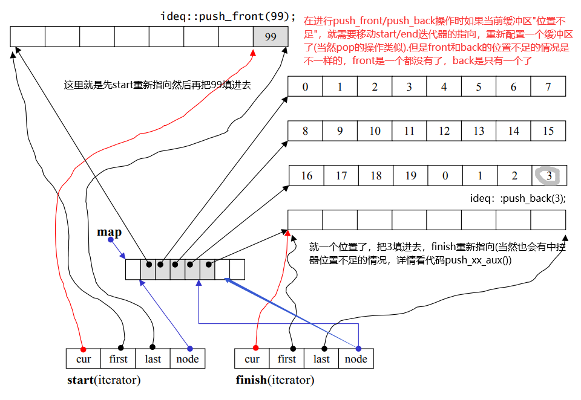

### 1.5. stack

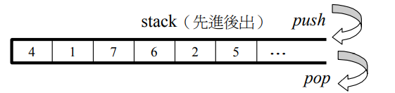

- 先进后出的数据结构
- 它的底层实现全都是用deque完成的，所以可以称呼它为adapter
- 因为先进后出的条件，所以stack没有迭代器
- 只要能符合先进后出，其他容器也可以作为stack的底层容器(例如list)

### 1.6. queue

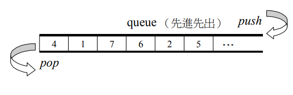

- 它是一种先进先出的数据结构
- 不允许遍历

### 1.7. heap

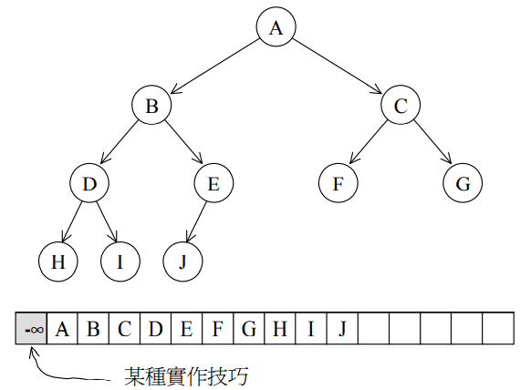

- heap并不归属于STL，它是priority queue的辅助，是它的底层机制
- binary就是一种完全二叉树
- 隐式表述法(implicit representation)
  - 将完全二叉树存到arrary中
  - 将array的0号位置保留，1号位置存放树的根
  - 那么某个节点在位置i处
    - 它的左子节点必在位置2*i处
    - 右子节点比在位置2*i+1处
    - 父节点比在i/2处
- 那么只需要一个array(用vector替代)和一组heap算法就可以实现了
  - heap算法：插入元素、删除元素、取极值、将数组排列成heap..
- heap可分为：
  - max-heap：节点的键值总是大于子节点的键值(之后的例子都是max-heap)
  - min-heap：节点的键值总是小于子节点的键值

#### 1.7.1 heap算法

**push_heap:**
向里面添加一个新元素(50)的步骤：
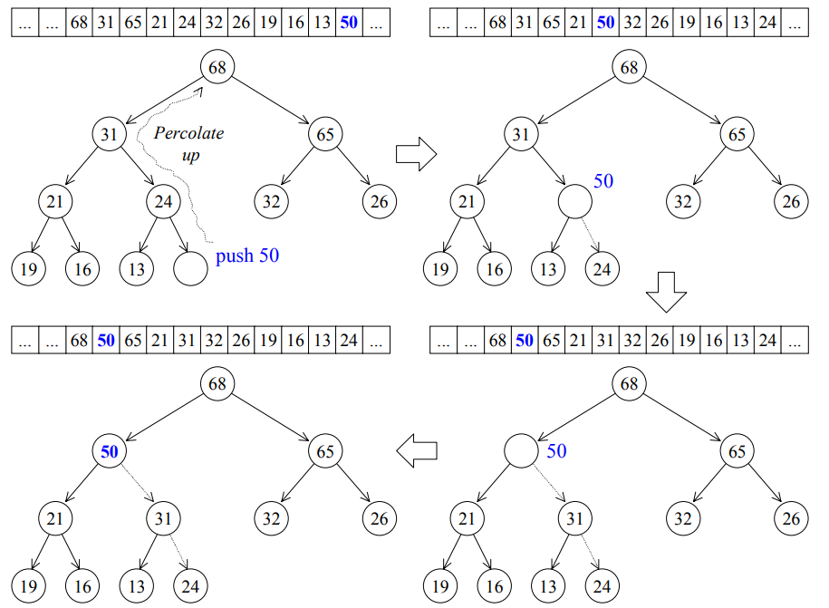

- 首先，由于需要它是完全二叉树，需要把元素放到容器的末尾
- 其次，为了满足max-heap的条件，需要执行上溯程序：
  - 与父节点比较大小看看是否需要互换位置。

**pop_heap:**
因为max-heap最大的就是根节点，所以这个操作就是把根节点去除
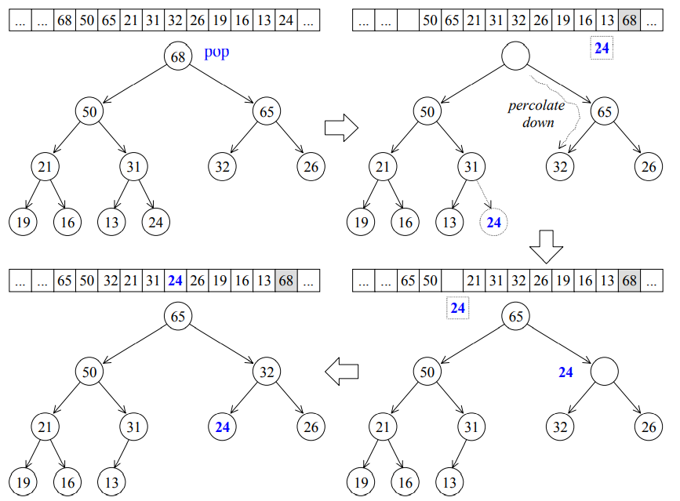

- 首先，它要去除的元素是根节点的元素
- 为了满足max-heap特性，需要进行下溯程序

**sort_heap:**
通过不断的pop来得到一个递增序列
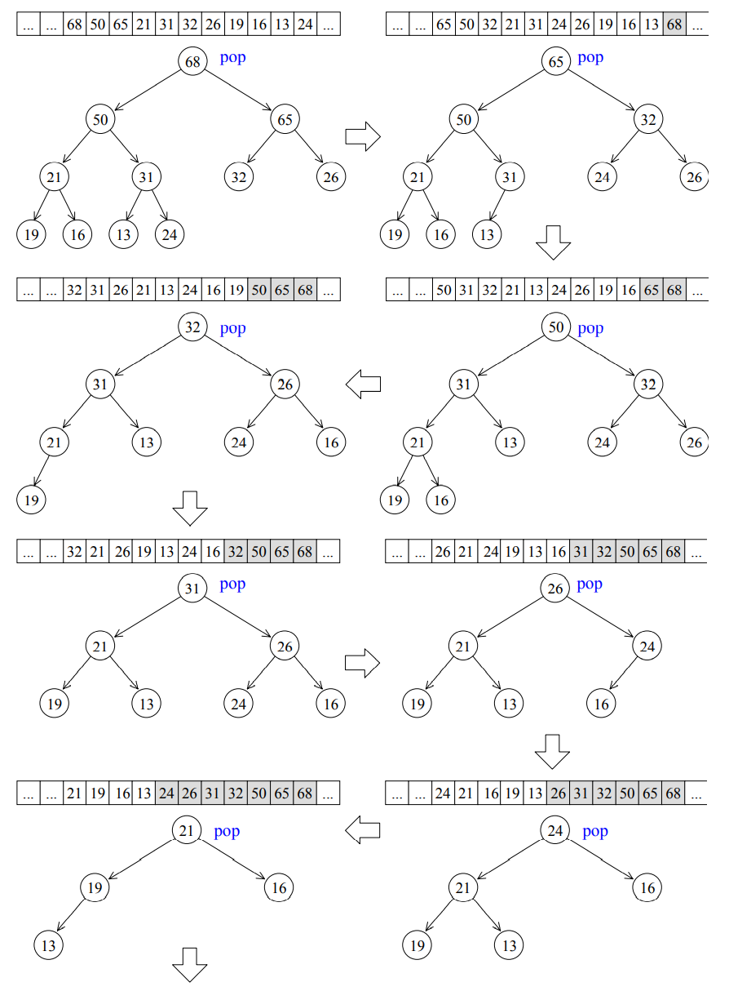
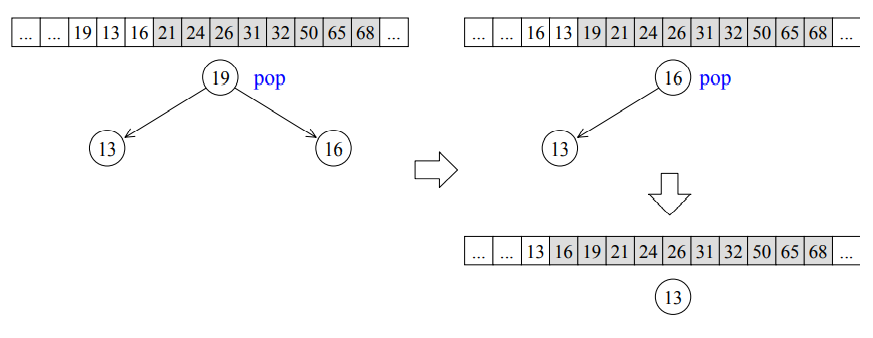

- 持续对heap做pop_heap操作，每次将范围向前缩减一个元素
- 每次pop操作都会把当前的极大值放到最后面的位置

**make_heap:**

- 用来将一段现有的数据转化为一个heap，依据就是完全二叉树的隐式表述

heap不提供遍历功能，所以没有迭代器

### 1.8. priority_queue

它就是一个拥有权值概念的queue

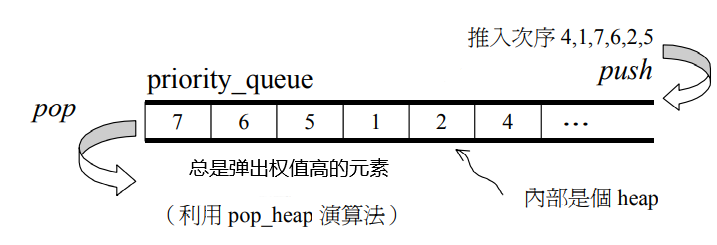

- 它里面的元素并不是按照添加的次序排列，而是自动按照元素的权值排列，权值越高越靠前
- 它可以利用max-heap来完成
- 它的底部容器是vector
- 没有迭代器

### 1.9. slist

- 它就是一个单向的链表
- 与list的最主要的区别就是：
  - list的迭代器是双向的Bidirectional Iterator
  - slist的迭代器是单向的Forward Iterator
- 由于它是单向的，所以insert和erase操作会很复杂，所以提供了：insert_after()、erase_after()
- 提供push_front()不提供push_back()

#### 1.9.1 slist的节点和迭代器

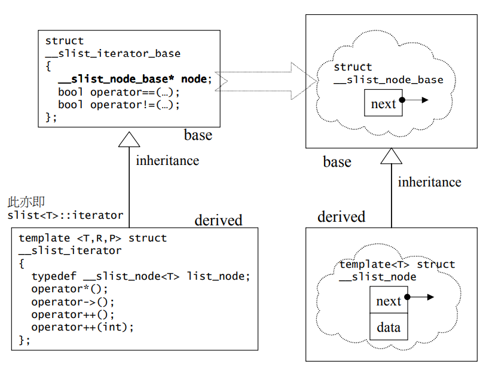

## 2. 关联式容器

- 关联式容器类似于关联式数据库
- 它每个元素都有一个key，一个value
- 插入元素后，容器会按照内部的结构把元素放到适当的位置
  - 这就导致它没有头尾，只有最大、最小元素
  - 它就不会有push_back()、push_front()、pop_back()、pop_front()、begin()、end()等操作
- 一般而言关联式容器内部结构是一个平衡二叉树

### 2.1. 树

- 树由节点和边构成
- 根节点：树的最上端
- 通过具有方向性的边相连的两个节点中
  - 父节点：上者
  - 子节点：下者
- 兄弟节点：具有同一个父节点
- 叶子节点：没有子节点的节点
- 路径长度：一个节点到另一个节点经过的边数
- 深度：根节点到任意节点的路径长度
- 树高：根节点到最远的那个节点的路径长度
- 二叉树：最多只允许有两个子节点

#### 2.1.1. 二叉搜索树

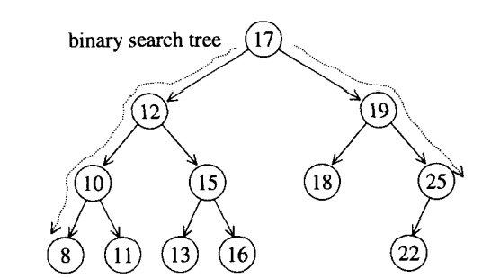

- 可提供对数时间的元素插入和访问
- 节点放置规则：
  - 任何节点的键值一定大于其左子树中的每一个节点的键值
  - 小于右子树中每个节点的键值
  - (大小顺序是中序)
- 插入操作就是从根节点开始比较，大就向右找，小就向左找

#### 2.1.2. 平衡二叉搜索树

- 平衡：不会出现某个节点过深
- 经过插入和删除操作会导致二叉树不平衡
- 平衡的二叉树搜索会比不平衡的二叉树要快，但是插入和删除操作会慢

##### 2.1.2.1. AVL tree

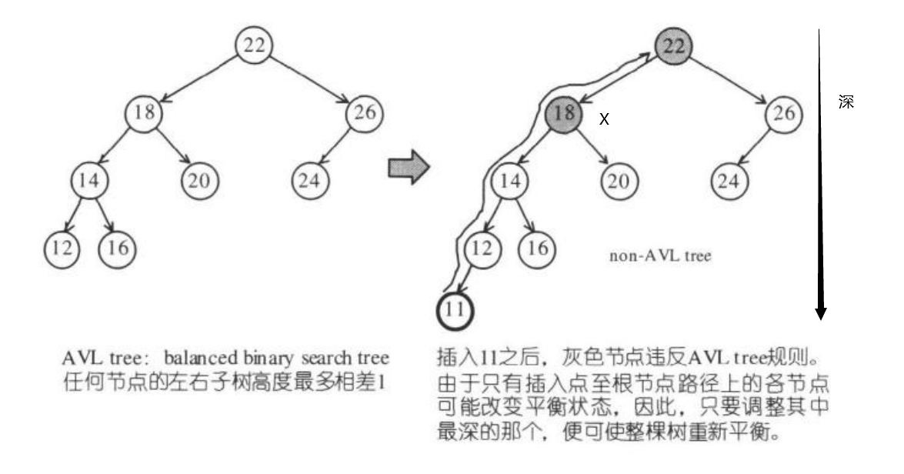

- AVL tree是一个"加上额外平衡条件"的二叉搜索树
- AVL tree的条件：要求任何节点的左右子树的高度相差最多为1
- 调整：只需要调整最深的那个被破坏了平衡状态的那个节点(X)就好了
  - 会有四种情况：
    1. 插入点位于X的左子节点的左子树
    2. 插入点位于X的左子节点的右子树
    3. 插入点位于X的右子节点的左子树
    4. 插入点位于X的右子节点的右子树
  - 1、4通过单旋转调整
  - 2、3通过双旋转调整

##### 2.1.2.2. 单旋转

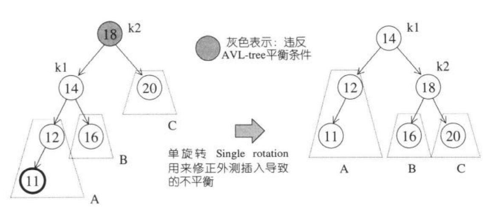

- 将k1上提，k2下调，并将k1的右子树作为k2的左子树(右右的情况类似)
  - k1上提是因为A子树太深了，急需让它变浅一些
  - 而K1提上去k2就要做它的右节点，因为是二叉树，所以B不能继续做子树
  - 而k2降下去子树减少1个并且k2必大于B，故让B做k2的左节点

##### 2.1.2.3. 双旋转

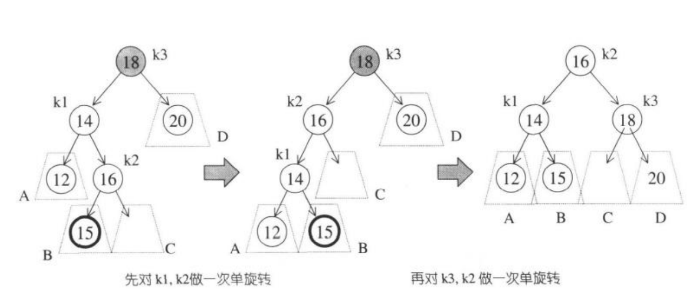

- 就是通过两次单旋转把k2提到最高，k1、k3分别做它的左右子树

### 2.2. RB-tree(这节的图中黑色为黑色，浅灰为红色)

- 红黑树的条件：
  1. 每个节点非红即黑
  2. 根节点为黑色
  3. 父子两节点不同时为红
  4. 任意节点到达NUMM节点的任意路径包含的黑节点数量必须相同

- 根据规则3：新增节点的父节点必须为黑
- 根据规则4：新增节点必须为红
- 如果不符合规则，需要调整颜色并旋转树
- set、multiset、map、multimap都是以红黑树为底层结构的

#### 2.2.1. 插入节点

插入节点出现问题,无论插入3，8，35，75哪一个都会破坏RB-tree
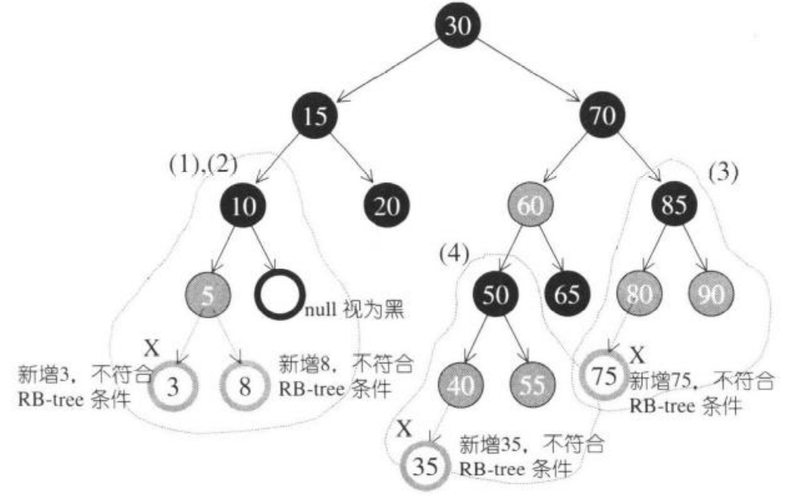
对它的四种调换就是单旋转或双旋转，中间加上颜色的变换而已

**规定：**

- X:新增节点
- P:新增节点的父节点
- G:祖父节点
- S:伯父节点
- GG:曾祖父节点

像上图那样的插入方式会出现四种情况

##### 2.2.1.1. 状况1

- S为黑，且X为外侧插入
- 对P,G做一次单旋转，并更改P,G的颜色,就满足条件了
- 可能会产生不平衡状态，不影响

##### 2.2.1.2. 状况2

- S为黑且X为内侧插入
- 对P、X做一次单旋转，改变G、X的颜色，再对G做一次单旋转

##### 2.2.1.3. 状况3

- S为红且X为外侧插入，
- 先对P、G做一次单旋转，改变X的颜色
- 若GG为黑结束，GG为红，见状况4

##### 2.2.1.4. 状况4

- S为红且G为外侧插入
- 对P、G做单旋转，改变X的颜色，GG为红则继续往上做，知道没有父子连续为红的状况

#### 2.2.2. 一个由上而下的程序

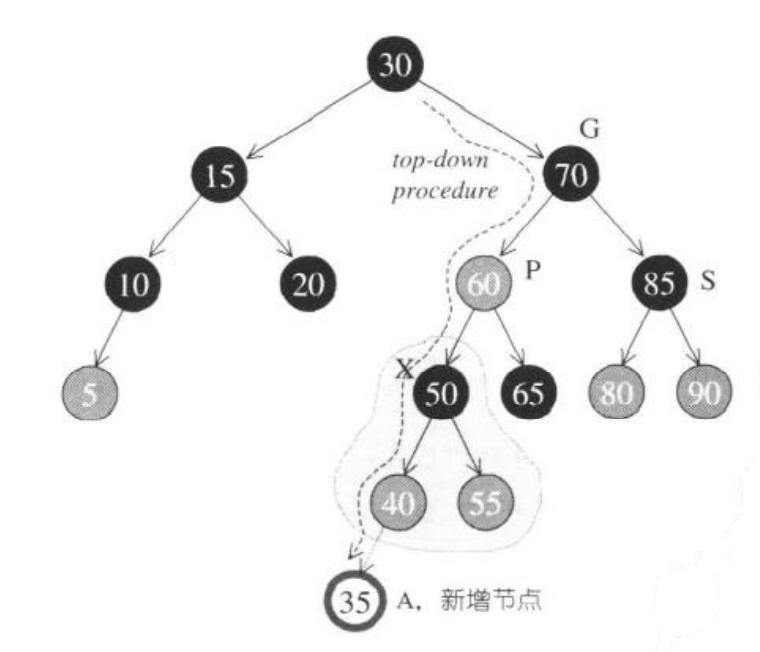

因为不希望看到2.2.1中的状况4，所以想这样来解决这个问题

- 假设新增节点A
- 沿着A的路径，只要看到有节点X的两个子节点都是红色
  - 就把X改为红色
  - 两个子节点改为黑色
  - 若X的父节点P也是红色
    - 就做一次单旋或一次双旋(像状况1、2那样)
    - S不可能为红(因为是从上到下的)

得到结果：

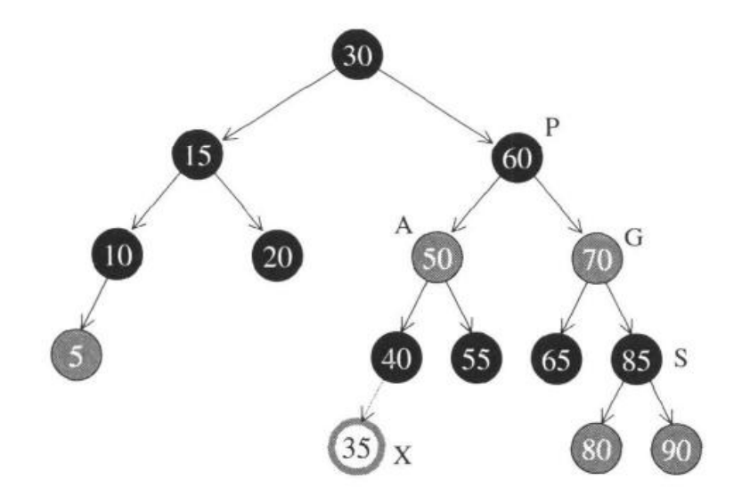

- 最后的结果插入就很简单了

#### 2.2.3. RB-tree的节点与迭代器的设计

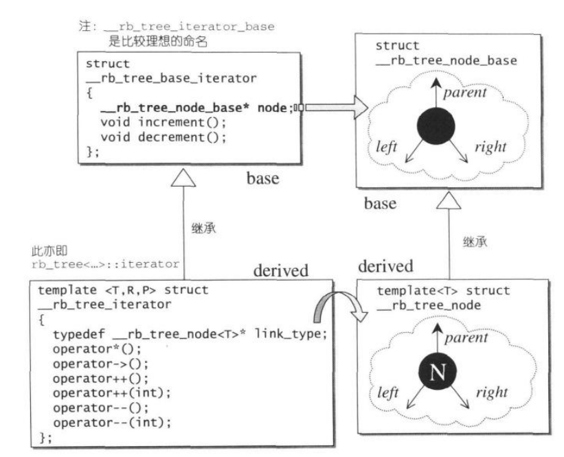

- 节点
  - 节点的颜色、它的父节点、它的左右子节点
- 迭代器
  - 双向迭代器，但不具备随机定位能力
  - 前进和后退的操作依据而擦手所属的节点排序法则

#### 2.2.4. 构造和内存管理

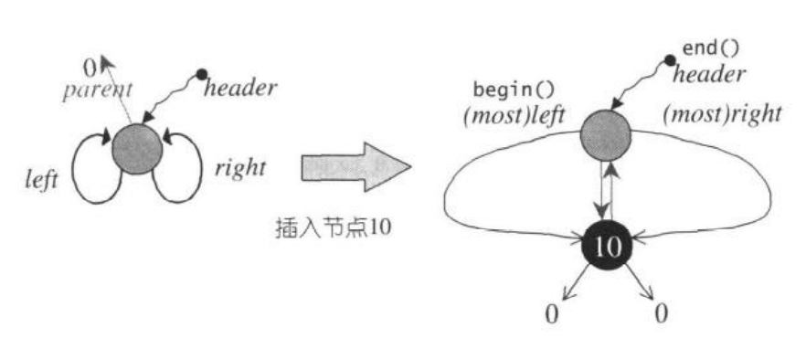
左侧为初始状态，右侧为加了一个节点后的状态

- 为根节点设计一个父节点header，设定了边界
- 而且header和root互为父节点
- RB-tree的两种构造方式
  - 以现有的RB-tree复制一个新的RB-tree
  - 产生一颗空树

#### 2.2.5. RB-tree的元素操作

- 插入元素
  - insert_equal()：允许重复
  - insert_unique()：不允许重复
  - 插入元素的逻辑就是前面自上而下的程序+单双旋
- 搜索元素
  - 作为二叉搜索树，搜索才是它的强项

### 2.3. set、multiset

- 所有元素都会根据元素的键值自动被排序
- set和multiset的key和value是合在一起的
- set:元素的key不可以重复
- 无法使用迭代器改变元素值
- 对元素进行操作后迭代器依然有效
- set和RB-tree的操作基本一致
- multiset与set的唯一区别:元素的key可以重复

### 2.4. map、multimap

- 它的所有元素会根据元素的键值自动被排序
- map所有元素都是pair，同时拥有key和value
- 它的底层支撑也是红黑树，它和set的区别就是：
  - set的value和key是同一个，它是分开的
- key不可以更改value可以更改

### 2.5. hashtable

- 它可以被视为一种字典结构，它的用意是提供常数时间的基本操作

#### 2.5.1. 散列表概述

- 散列函数：把人一场的输入字符串变化成固定长的输出字符串的函数
  - 输出字符串的长度称为散列函数的位数
- 散列通过散列函数将要检索的项与索引关联起来，生成一种便于搜索的数据结构(散列表)
- 散列的概念属于查找，使用直接寻址技术，理想情况查找时间为O(1)
- 哈希冲突：不同元素被映射到相同的位置(不可避免)
  - 这就是碰撞问题，解决方法：
    - 线性探测
    - 二次探测
    - 开链
    - ...

##### 2.5.1.1. 线性探测

- 负载系数：元素个数除以表格大小
  - 负载系数永远在0~1之间(除非采用开链策略)
- 哈希函数计算出元素的插入位置，但是该空间已经被使用，继续往下一次寻找，到达尾端就从头再找，直到找到空间
- 在搜索元素的时候也是这样，先通过哈希函数计算位置，不符合就往下找，直到找到或者遇到空位置
- 删除元素就需要使用惰性删除
  - 惰性删除：
    - 只标记删除记号，在表格重新整理的时候才会进行删除
- 问题：主集团
  - 主集团：平均插入成本的成长幅度远高于负载系数的成长幅度

##### 2.5.1.2. 二次探测

- 二次探测主要用来解决主集团的问题
  - 当通过哈希函数计算出的位置H已经被占用：
    - 线性探测：H+1,H+2,H+3...
    - 二次探测：H+1^2,H+2^2,H+3^2...
  - 这样就会快速逃离主集团的泥潭
- 问题：
  - 二次探测能否保证每次探测的是不同的位置？
  - 二次探测能否保证当表格中没有X，插入X一定成功？
  - 是否会在执行效率上带来负面影响？
  - 负载系数过高时，表格能否动态成长？
- 在表格大小为质数，并负载系数超过0.5就重新整理表格，可以保证每次插入一个新元素所需要的探测次数不多于2
- H_i = H_i-1 + 2*i-1(mod M):通过前一个H值来计算下一个H值，可以降低复杂度，提高效率
- array增长：找到一个新的、大约2倍大小的质数作为新array的大小，然后计算旧表格中数据的位置，插入到新表格中
- 消除了主集团，却可能造成次集团
  - 次集团：两个元素经过哈希函数计算出来的位置如果相同，那么探测时候的位置也会相同
  - 复式散列可以消除次集团

##### 2.5.1.3. 开链

- 在每一个表格元素中维护一个list
  - 通过哈希函数找到对应的表格位置，然后在list上进行元素的插入、搜索、删除等操作
- 如果list都很短很均衡，它的速度还是很好的
- hash table 就是采用这种做法

#### 2.5.2. hash table 的桶(buckets)和节点(nodes)

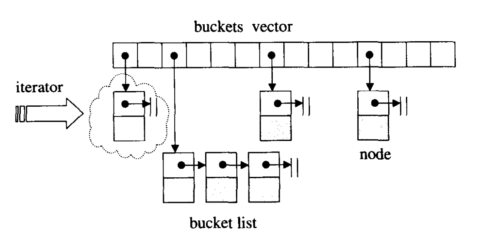

- 它的表格内的元素为桶，可能是因为表格内的每个单元可能都不是只有一个，而是一桶
- 桶也是容器，它是一个list，就是每个单元里面有个list
- 这个list并不是前面的顺序容器的list或slist，而是__hashtable_node,只是它行为比较像STL的list而已

#### 2.5.3. hash table 的迭代器

- hashtable的迭代器必须永远维系着与整个“buckets vector”的关系，并记录当前所指节点
- 前进操作是利用节点内安置的list进行next的指针进行前进操作
  - 如果目前处于list的尾端，就跳到下一个bucket身上，也就是指向下一个list的头部节点
- hashtable的迭代器没有后退操作

#### 2.5.4. hash table 的数据结构

- buckets聚合体以vector完成，便于动态扩充

#### 2.5.5. hash table 的构造与内存管理

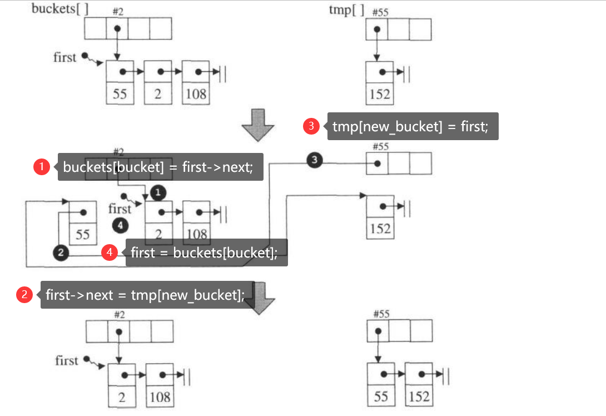

- 这是表格重建的关键点
  - 两层循环
    - 外层遍历buckets
    - 内层遍历bucket
  - 这个是内层为每个元素寻找新归宿的逻辑
- hash table 是由 vector 和 linked-list 组合
  - 在复制和删除的时候要注意内存释放问题

#### 2.5.6. hash function

- <stl_hash_fun.h>定义有多个hash function，都是仿函数
- hash function是用来计算元素位置的函数
  - SGI使用bkt_num()来调用它
  - 但是有些型别他没有提供处理方法，会造成错误

### 2.6. hash_set、hash_multiset

- set以RB-tree为底层机制，hash_set以hash table为底层机制
  - set有自动排序的功能，而hash_set没有
- multiset以RB-tree为底层机制，hash_multiset以hash table为底层机制
  - multiset有自动排序的功能，而hash_multiset没有
- hash_set不可重复插入，而hash_multiset可重复插入

### 2.7. hash_map、hash_multimap

- map以RB-tree为底层机制，hash_map以hash table为底层机制
  - map有自动排序的功能，而hash_map没有
- multimap以RB-tree为底层机制，hash_multimap以hash table为底层机制
  - multimap有自动排序的功能，而hash_multimap没有
- hash_map不可重复插入，而hash_multimap可重复插入
